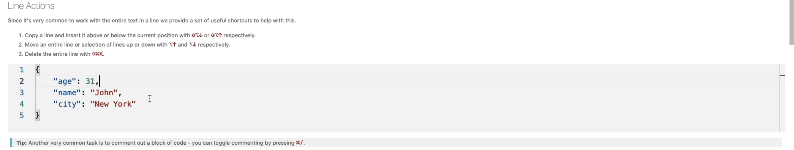
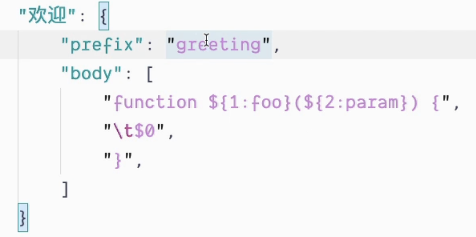

# VSCode

## 写在前面

您当下所使用的版本可能与本文演示的版本不同，细节方面请以最新版为准，本文仅供参考！

## 安装 && 认识界面

[点击](https://code.visualstudio.com/)跳转官网下载安装

打开后左侧边栏最下方的四个方块组成的图标，点击进入可以对插件进行管理，以将界面汉化为例，搜索`Chinese`进行install：

安装成功后，右下角会弹窗提示需要重启软件以生效该插件，点击`Yes`即可自动重启。 如果不小心错过了右下角的弹窗，手动关闭软件再打开也是可行的。

此时，您的VSCode将以简体中文显示。

在**欢迎使用**页面（如上图所示），点击右下方学习板块的**界面概览**，可以查看VSCode的主要UI组件的功能概述，包括左侧边栏，界面上、下方的图标功能及其对应快捷键等等； 左下方帮助板块的第一行，点击会打开一个pdf文件，里面囊括了VSCode中所有快捷键（当前只有英文版的速查表）； 右上方自定义板块中可以点击**颜色主题**来选择软件主题，通过按方向键的上下以快速预览，也能根据提示下载更多主题。

现在，您已经掌握了VSCode界面概况及其最基础的个性化定制功能，在兴奋之余，可以多看看这个**欢迎使用**界面，它能教你的只有更多，其中一部分后文会提到，更深入地探索有待您个人发掘。

原生VSCode并非支持一切语言，但是它拥有丰富的插件库，几乎可以根据您的个人喜好搭建一个专属于您的开发环境。

## 交互式演练场

在欢迎使用页面点击右下角的交互式演练场，或者在最上方栏目中的帮助选项中点击进入，当前这个演练场是全英文的，不管你是否安装了简体中文插件。

### 多光标编辑

根据您机器上提示的快捷键，可以对内容进行多光标编辑，即：光标同时出现在多行，或多行同时选中形成一块矩形区域，此时您键入的任何操作都将同时作用在多行。例如：您在多光标模式下输入一串字符串，那么在您光标出现的每一行都将出现同样的字符串。

### 智能补全

当前版本的原生VSCode默认支持`JavaScript`和`TypeScript`，想要支持更多语言需要通过插件安装。

触发智能补全有两种方式，一是编写代码的过程中，例如下面这个例子，当您顺序输入`req.`的过程中，就会自动弹出提示区域；二是如果您错过了提示（比如光标挪了位置再挪回来），可以通过快捷键（根据您的机器，演练场会提供对应的快捷键，这里是`ctrl + Space`）呼出，当然，不嫌麻烦的话您也可以把`req.`删除再重新键入以自动触发。

### 以“行”为单位快速操作

根据您的机器，演练场会提示您对应的快捷键。

当前光标所在位置为操作行，您可以对这一行进行快速向上/向下复制粘贴整行，快速向上/向下移动整行，快速删除整行。

### 重命名

当您需要快速修改函数名、变量名之类的标识的时候，可以在对应位置按`F2`，键入新的名字回车。

此功能会根据语法分析你想要改的到底是哪些位置，尤其是当你的代码中或注释中出现类似的名字的时候十分好用。

### 格式化

当您拿到一份格式不规范的代码的时候，按照您机器上提示的快捷键可以快速将文件内容格式化。

格式化的规则您可以根据自己的习惯搭配风格设置。

### 代码折叠

当编写完一块功能代码，暂时不需要管它的时候，您可以将这一块内容折叠起来，有两种方式：一是鼠标点击行号栏旁边的箭头，二是用您机器提供给您的快捷键快速折叠/展开光标所在位置区块的代码。

### 快速生成空白代码块

输入部分内容后看到提示内容有您接下去想要键入的内容，此时直接按`Tab`就可以快速生成该部分的空白代码框架，方便您填入内容而不需要手动敲其整体代码结构。

**注意：**本文只截取简述了交互式演练场中演示的常用功能，VSCode的强大远不止于此，更多需要深入探究的功能需要您在开发过程中循序渐进地体会运用。

## 自定义代码片段

在**命令面板**（欢迎页右下角学习板块第一行）搜索`Configure User Snippets`（不用打全），进入后选择你想要为哪个语言配置自定义的代码片段，或全局代码片段（适用于任何语言），再或者为当前文件夹自定义代码片段（只适用于当前文件夹/项目）。

根据注释内容样例，即可编写独属于自己的代码片段。保存之后，在对应代码语言的文件中，即可通过您设置的`prefix`来快速生成`body`里的代码片段。

此时点击或者`Tab`键即可补全`console.log('hello')`这一编写在对应`body`中的内容。

用`$`后接数字（及默认显示的字符串）的格式放入`body`，即可实现在补全后更改内容，第一个更改的位置为所有`$1`，按`Tab`后跳转到所有`$2`的位置修改，以此类推，但是，`$0`并不在这个顺序之中，它表示光标最后所在的位置。

补全后，键入内容将覆盖`foo`区域，按`Tab`后将跳转到`param`区域，键入内容将覆盖它，最后光标会定位在`$0`也就是函数体的第一行制表符`\t`之后。

除此之外，还可以通过安装代码片段插件来进一步丰富内容，为编码再助一份力。

**在线生成代码片段：**https://snippet-generator.app/

## 多光标功能

按住`alt`键点击鼠标，出现光标的同时，上一个位置的光标不会消失，当有多个光标闪动的时候，任何输入都将同时作用在光标位置。

按住鼠标中间的同时滑动鼠标，将选中一块矩形区域，这一块区域内的每一行都将闪动光标以支持批量操作。

选择好需要修改的东西，然后按`shift + cmd + L`（其它系统环境可以参照各自软件提示的快捷键）即可批量选中相同的内容同时对它们进行更改。

`ctrl + a`全选，然后`shift + alt + I`，光标将于每一行的行末闪烁。

`alt + cmd + 键盘上/下` => 在当前光标所处位置的上/下添加一个光标以支持批量操作。

选中一块区域，`cmd + d`，将依次向下选中相同内容的区域，这样就能做到只修改其中一部分，而不是一次性修改所有同样的内容区域。

在自定义代码片段使用多光标功能：只需要`$`符号后的数字相同即可。

## 其它操作技巧

除了鼠标滚轮上下翻页之外，可以通过键盘上的`page up`和`page down`来实现。

快速跳转到某一行：`cmd + g`然后输入行号回车，或者在页面上右键选择命令面板键入`go to line/...`（不需要打全，会有提示）选择后再输入行号回车。

在一段文本上快速双击即可选中这一段文本，三连击即可选中这一行，任意位置四连击即可全选。

先将光标定位在第1行，此时`cmd + g`输入100，不要急着按回车，而是按住`shift`键再点击第100行位置，这样就能在不滑动鼠标的情况下选择大片区域。

对于引入的文件，按住`cmd`再去点击即可快速跳转到该文件，或者跳转到对应文件的函数位置等。 利用这个技巧，可以快速创建一个新的文件：引入一个并不存在的文件，再尝试跳转进这个文件，VSCode就会提示并帮助您一键新建文件。（支持创建多级文件夹下的文件，即使路径中的文件夹并不存在）

上述跳转适用于文件内，比如一个文件既有函数实现也有函数调用，在调用位置`cmd`再点击，会跳转到实现部分，方便查看。在查看结束后，`cmd`加上`-`号可以快速跳转到上次所在的位置。

在函数等位置鼠标悬停，会提示参数、返回值等信息。

在侧边栏创建文件时，如果文件名输入的是`a/b/c/d.ts`，那么会在当前目录下先新建多级文件夹`a/b/c`，再在最里层的`c`文件夹下创建`d.ts`文件。

选中一段文本后，按住左键，然后再去移动，会出现一个虚线光标，当虚线光标出现在你想要的位置后，松开左键，被选中的内容就会被移动到此处。 如果在松开左键前，按住`alt`键，会出现一个加号，此时再松开左键，那么选中的内容就会被复制一份粘贴到虚线光标处。